# WayMark

WayMark is a full-stack MERN travel community app where users can share travel memories, upload images, pin locations on an interactive map, discover travelers, like and comment on memories, manage bucket-list destinations, view notifications, update account settings, and track personal travel stats.

## Live Links

**Frontend:** https://way-mark-xi.vercel.app

**Backend API:** https://waymark-production-c107.up.railway.app/

## Tech Stack

### Frontend

* React
* Vite
* Tailwind CSS
* React Router
* Axios
* React Leaflet
* Leaflet
* Lucide React
* Vercel

### Backend

* Node.js
* Express.js
* MongoDB Atlas
* Mongoose
* JWT Authentication
* bcryptjs
* Cloudinary
* Multer
* Swagger
* Render

## Features

* User registration and login with JWT authentication
* Protected routes for logged-in users
* Change password from account settings
* Create travel memories with image upload
* Upload multiple images using Cloudinary
* Search locations and auto-fill city, country, latitude, and longitude
* Pick locations directly from an interactive map
* View feed of public travel memories
* Like and unlike memories
* Add and delete comments
* Save and unsave memories
* Search travelers and memories
* Explore page with map-based memory discovery
* Public traveler profiles
* Edit own profile details
* Follow and unfollow users
* Notification system for follows, likes, and comments
* Mark notifications as read
* Bucket list page
* Add, edit, delete, and mark bucket-list destinations as visited
* Journey page grouped by country and city
* Passport page showing visited countries and cities
* Travel Wrapped page with yearly travel stats
* Settings page with profile update, password change, and logout
* Mobile responsive UI
* Custom toast notifications
* Custom confirmation dialogs
* Skeleton loading states
* Production deployment on Vercel and Render

## Screenshots

### Desktop View

#### Landing Page

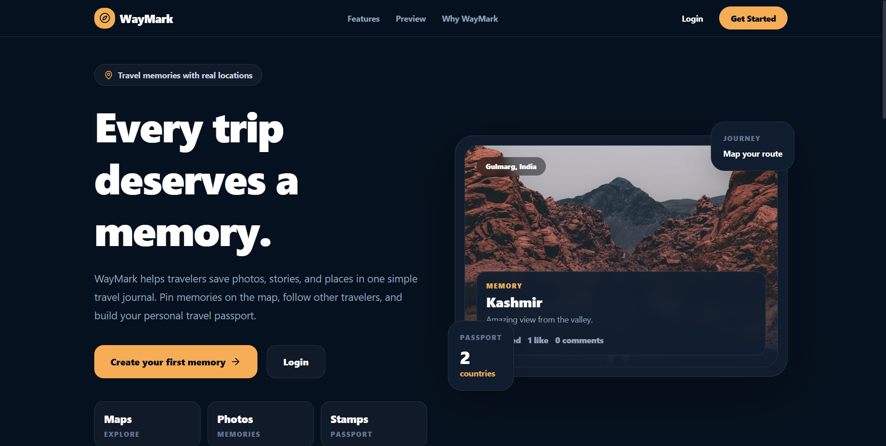

#### Login Page

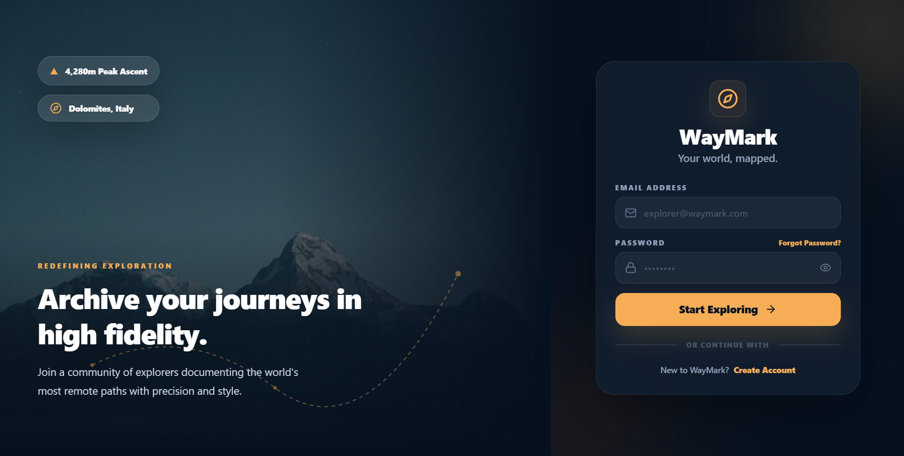

#### Feed Page

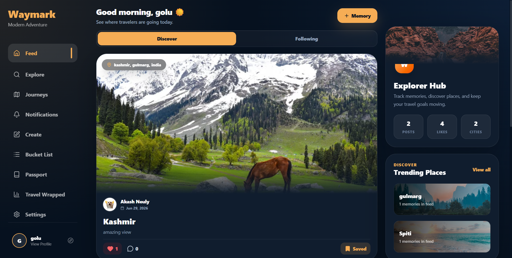

#### Create Memory Page

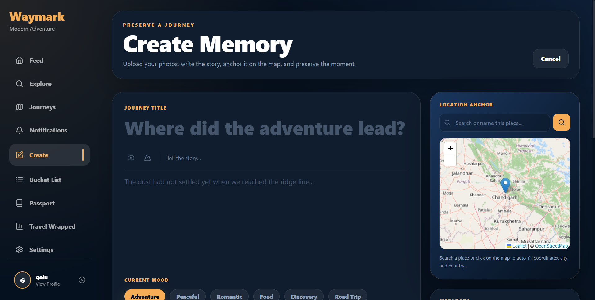

#### Explore Page

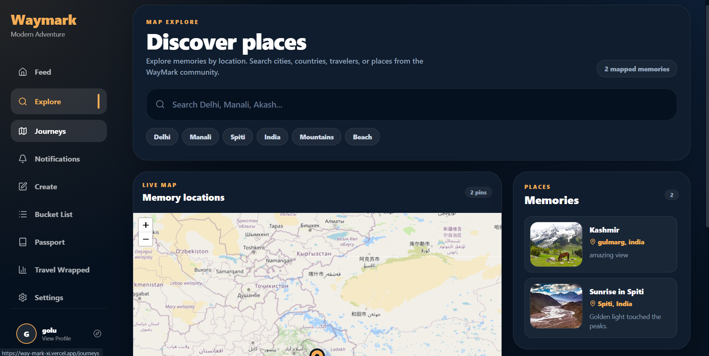

#### Journey Page

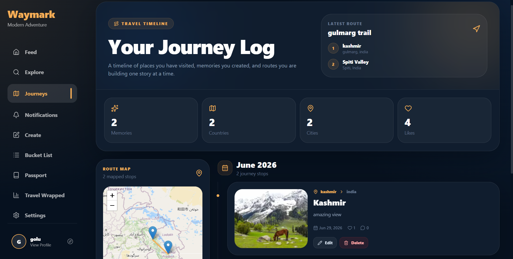

#### Profile Page

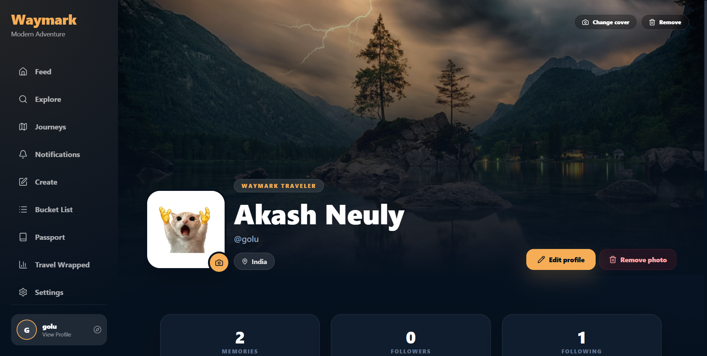

#### Passport Page

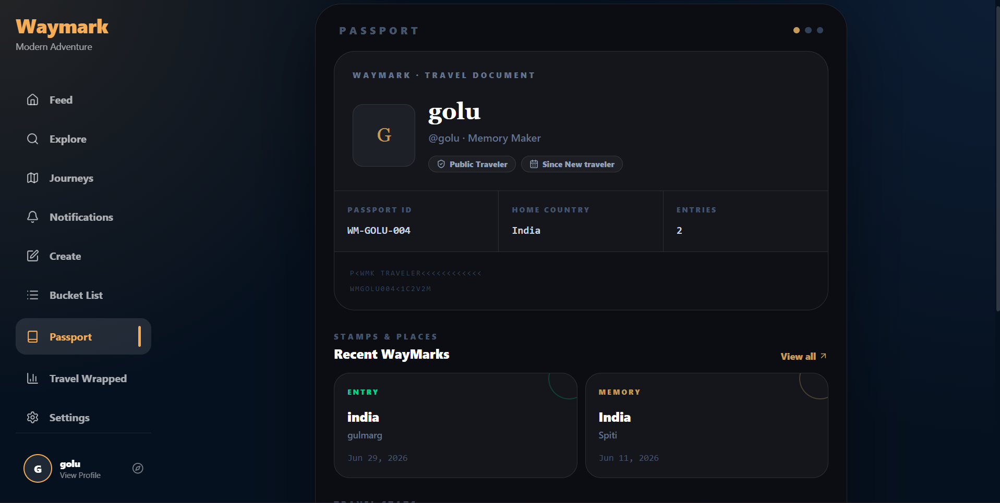

#### Settings Page

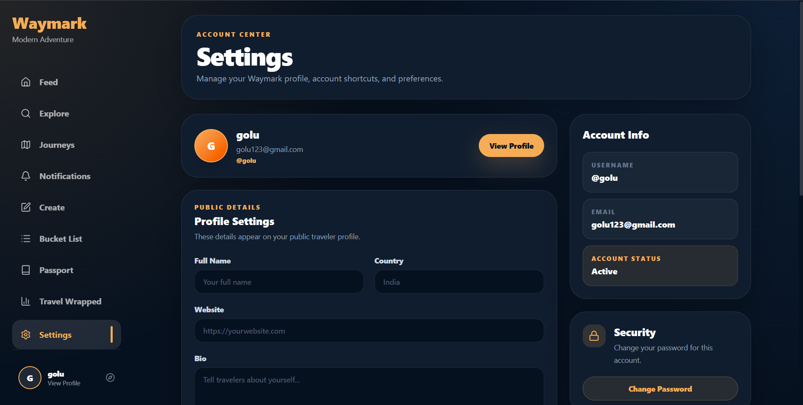

#### Memory Detail Page

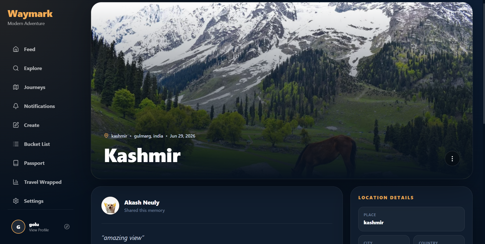

### Mobile View

#### Landing Page

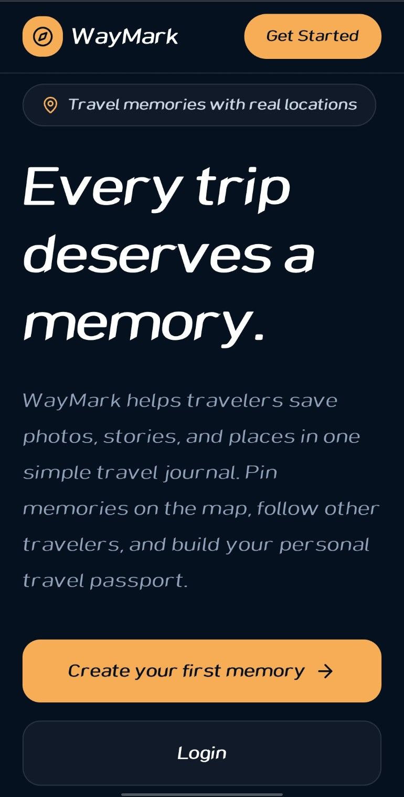

#### Register Page

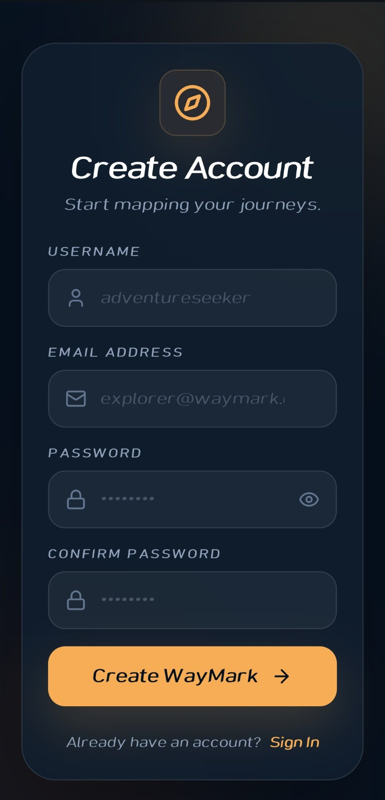

#### Login Page

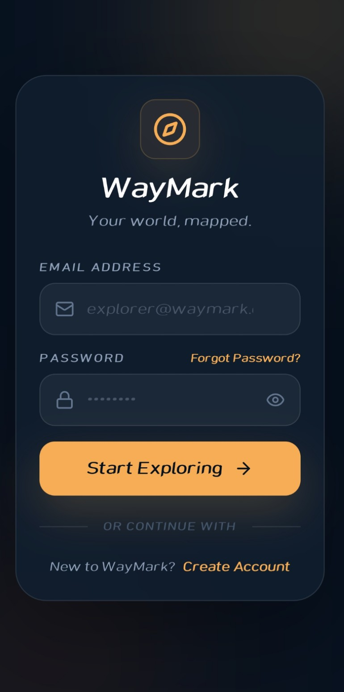

#### Feed Page

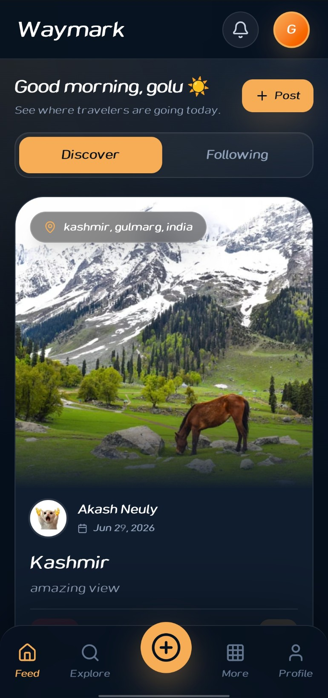

#### Create Memory Page

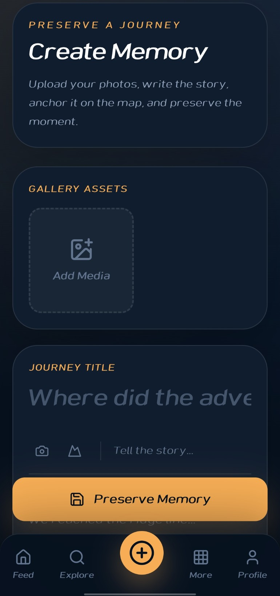

#### Explore Page

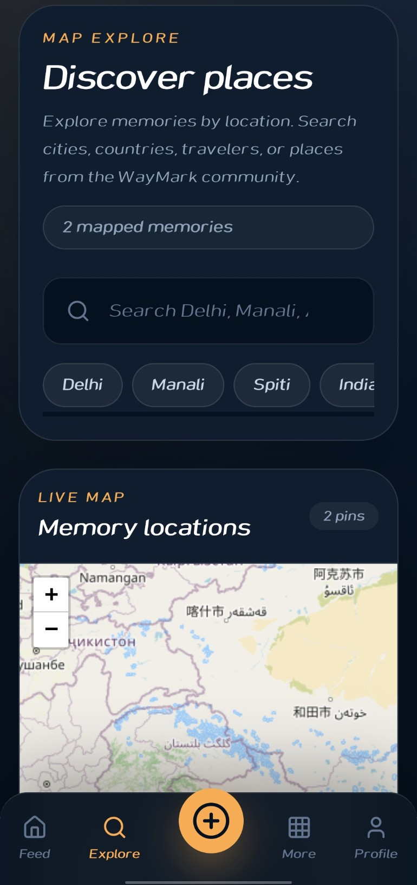

#### Journey Page

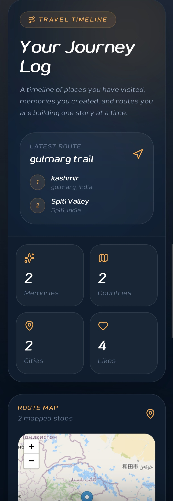

#### Profile Page

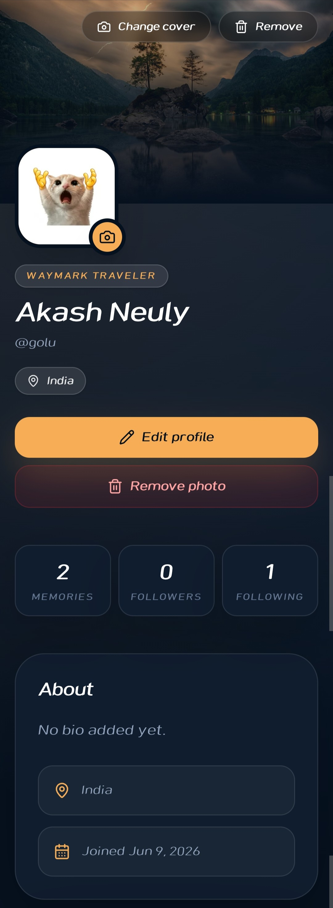

#### Passport Page

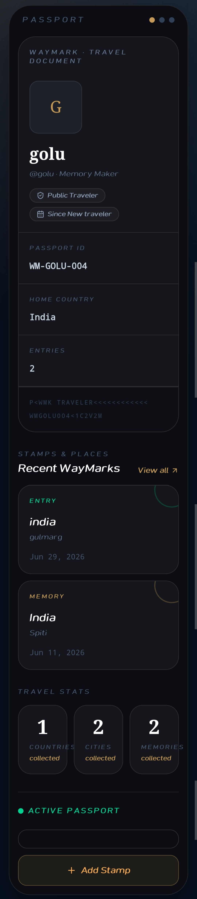

#### Settings Page

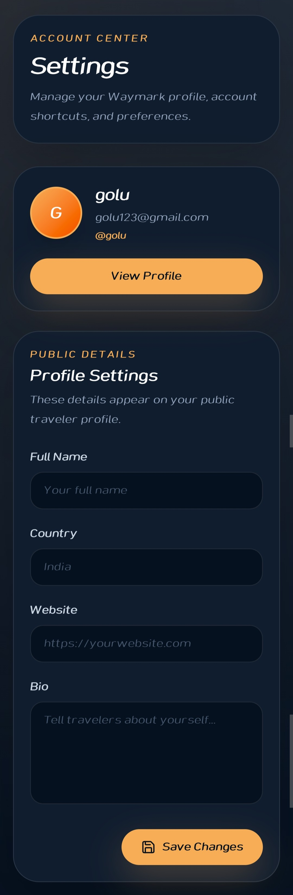

#### Memory Detail Page

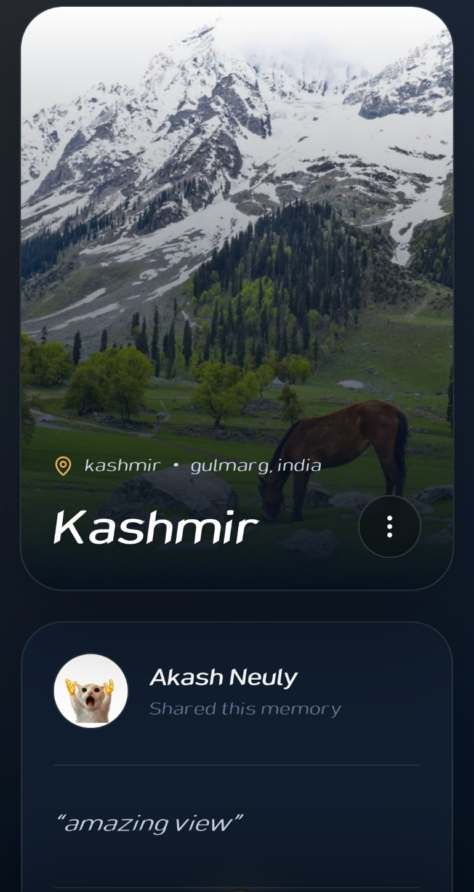

## Environment Variables

### Frontend

Create a `.env` file inside `waymark-client`:

```env
VITE_API_BASE_URL=http://localhost:5000/api
```

For production on Vercel:

```env
VITE_API_BASE_URL=https://waymark-production-c107.up.railway.app/api
```

### Backend

Create a `.env` file inside `waymark-server`:

```env
PORT=5000
MONGO_URI=your_mongodb_atlas_connection_string
JWT_SECRET=your_jwt_secret
CLIENT_URL=http://localhost:5173

CLOUDINARY_CLOUD_NAME=your_cloudinary_cloud_name
CLOUDINARY_API_KEY=your_cloudinary_api_key
CLOUDINARY_API_SECRET=your_cloudinary_api_secret
```

For production on Railway:

```env
MONGO_URI=your_mongodb_atlas_connection_string
JWT_SECRET=your_jwt_secret
CLIENT_URL=https://way-mark-xi.vercel.app

CLOUDINARY_CLOUD_NAME=your_cloudinary_cloud_name
CLOUDINARY_API_KEY=your_cloudinary_api_key
CLOUDINARY_API_SECRET=your_cloudinary_api_secret
```

## How to Run Locally

### 1. Clone the repository

```bash
git clone https://github.com/AkashNeuly167/WayMark.git
cd WayMark
```

### 2. Install backend dependencies

```bash
cd waymark-server
npm install
```

Create `.env` inside `waymark-server` and add the backend environment variables.

Start backend:

```bash
npm run dev
```

Backend will run on:

```txt
http://localhost:5000
```

Swagger API docs:

```txt
http://localhost:5000/api-docs
```

### 3. Install frontend dependencies

Open a new terminal:

```bash
cd waymark-client
npm install
```

Create `.env` inside `waymark-client` and add:

```env
VITE_API_BASE_URL=http://localhost:5000/api
```

Start frontend:

```bash
npm run dev
```

Frontend will run on:

```txt
http://localhost:5173
```

## Build Frontend

```bash
cd waymark-client
npm run build
```

## Run Backend in Production Mode

```bash
cd waymark-server
npm start
```

## API Documentation

Swagger API documentation is available on the backend server.

Local Swagger URL:

```txt
http://localhost:5000/api-docs
```

Main API modules:

* Auth
* Users
* Memories
* Comments
* Likes
* Saved Memories
* Follow / Unfollow
* Notifications
* Bucket List
* Uploads

## Deployment

### Frontend

The frontend is deployed on Vercel.

Important production environment variable:

```env
VITE_API_BASE_URL=https://waymark-production-c107.up.railway.app/api
```

The project includes a `vercel.json` file to support React Router refresh on deployed routes.

### Backend

The backend is deployed on Railway.

Important production environment variable:

```env
CLIENT_URL=https://way-mark-xi.vercel.app
```

The backend allows requests from the deployed Vercel frontend using CORS.

## Project Structure

```txt
WayMark
├── Screenshots
│   ├── Desktop
│   └── Mobile
│
├── waymark-client
│   ├── src
│   │   ├── api
│   │   ├── components
│   │   ├── context
│   │   ├── pages
│   │   ├── routes
│   │   ├── services
│   │   └── utils
│   └── package.json
│
└── waymark-server
    ├── src
    │   ├── config
    │   ├── controllers
    │   ├── middleware
    │   ├── models
    │   ├── routes
    │   └── utils
    └── package.json
```

## Author

Built by Akash Neuly.
